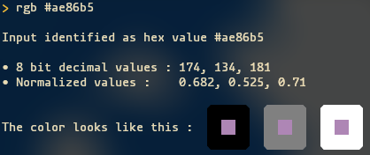

# PyRGB 🎨

## A simple rgb color converter written in python 3

Use `rgb.py -h` to get help about its features !

It can :  
- convert a color between 8 bit decimal, normalized decimals and hexadecimal formats
- display the <r>c</r><o>o</o><y>l</y><g>o</g><bl>r</bl> in neat little blocks if your terminal supports full color !
